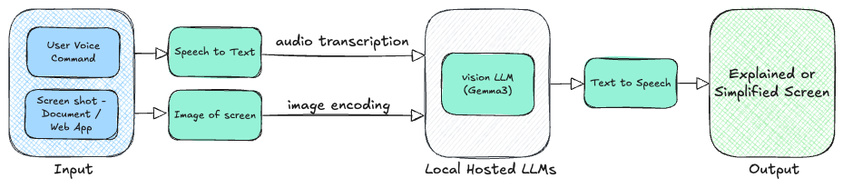

# HighRiskProject - AI in Healthcare

The project showcases using a Vision Language Model to improve digital accessibility by acting as an enhanced screen reader.

## Table of Contents

- [About](#about)
- [Features](#features)
- [Installation](#installation)
- [Usage](#usage)
- [Contributing](#contributing)

## About

HighRiskProject leverages advanced Vision Language Models to interpret visual content and provide descriptive, accessible outputs for users with visual impairments. The goal is to bridge accessibility gaps on digital platforms by offering a more intelligent and context-aware screen reading experience.

## Features

- Utilizes Vision Language Models for interpreting images and visual elements.
- Provides detailed and context-sensitive descriptions to users.
- Aims to enhance digital accessibility and user independence.

## Installation

Clone the repository:

```bash
git clone https://github.com/utbhanuarya/HighRiskProject.git
```

Navigate to the project directory:

```bash
cd HighRiskProject
```

Install dependencies (update this section with specific requirements as needed):

```bash
# Example for Python projects
pip install -r requirements.txt
```

## Usage

Run the streamlit application (replace with actual command or script):

```bash
steamlit run app.py
```

The tool will process visual content and output accessible descriptions.

## Contributing

Contributions are welcome! Please fork the repository and submit a pull request with your improvements. For major changes, open an issue first to discuss your ideas.
